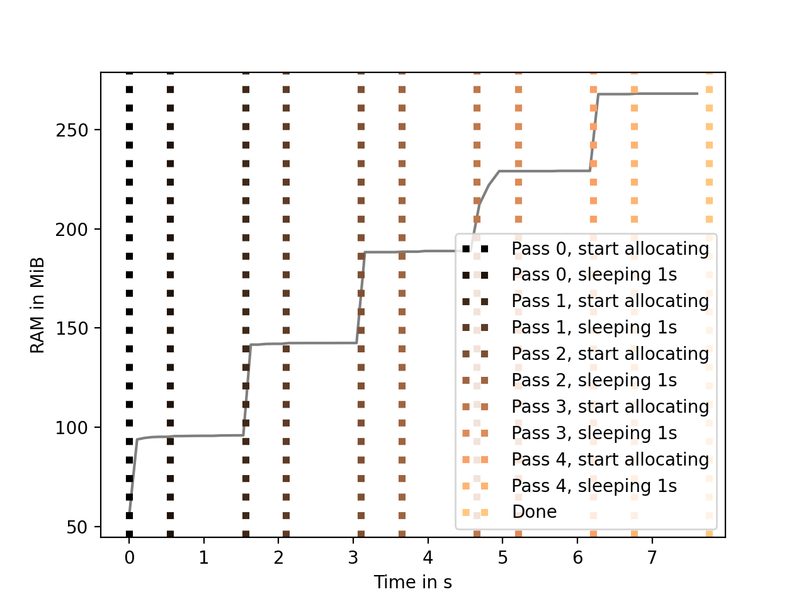

# log_ps

Logs ps output for monitoring script ressource usage.

## Install

```
git clone 
cd log_ps
pip install [--user] .
```

## Usage

- Is this tested and safe and does not crash stuff: I don't know...

### Inside a script

The `PSLogger` class can be used inside any script an provides tagging.
Example:

 ```
import os
import time

from log_ps import PSLogger, summary_plot_ram


if __name__ == "__main__":
    PID = os.getpid()
    print("Start logging PID {}".format(PID))
    log_fname = "./test_log.json"
    logger = PSLogger(PID, fname=log_fname, interval=0.1)
    logger.start()

    arr = []
    for i in range(5):
        print("Main allocating a few GB, pass {}".format(i))
        logger.tag("Pass {}, start allocating".format(i))
        arr.append([i for i in range(int(1e7))])
        print("Main sleeps for 1s")
        logger.tag("Pass {}, sleeping 1s".format(i))
        time.sleep(1)

    print("Main is done")
    logger.tag("Done")
    print("Stopping thread")
    logs = logger.stop()

    print("Showing log results")
    summary_plot_ram(
        log_fname, plotname=log_fname.replace(".json", ".png"),
        ram_unit="GiB", axvline_lw=4, axvline_ls=":",
        plot_c="C7", cmap="copper", savefig_dpi=200)
```

### As CLI tool

An entrypoint called `log_ps` is available:

```
usage: log_ps [-h] -o OUTF [-n INTERVAL] [-v] pid

positional arguments:
  pid                   Process ID to watch.

optional arguments:
  -h, --help            show this help message and exit
  -o OUTF, --outf OUTF  Filename of the output file. Data is stored in JSON format.
  -n INTERVAL, --interval INTERVAL
                        Integer time interval in seconds to sample `ps`. Default: 1.
  -v, --verbose         If given, print message for each sampling.
```

This does not have the ability to add tags and you have to provide the PID eg. from htop or print it from your script when it starts

```
import os, time
print("PID is ", os.getpid())
time.sleep(5)  # So you can copy&paste the PID...
...
```

## Output

Output is a JSON file with the ps stats for each logged timestamp.
There is a `load_log` wrapper which just saves you two lines and an import to load the JSON file into a dict.

Also there is a `summary_plot_ram` method which takes logged stats and makes a time vs RAM (RSS) usage plot in one go.
Here is the one from the included example:


